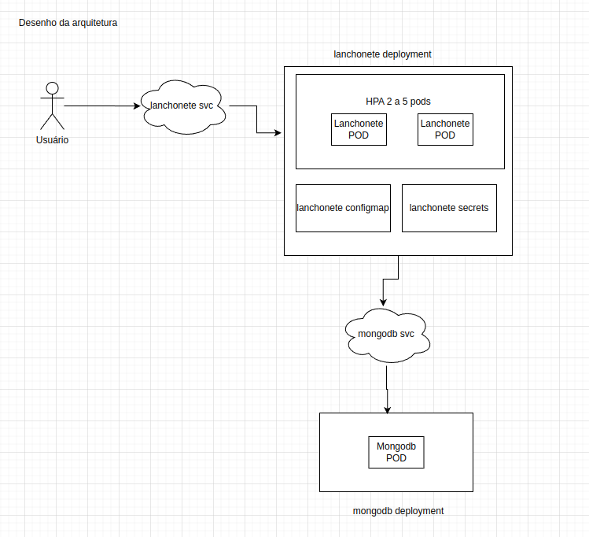

# Clean Arch Lanchonete
Projeto de arquitetura limpa do curso de pós graduação da FIAP

# Link do vídeo de demonstração da arquitetura
Link

# Desenho da Arquitetura


# Como rodar o projeto?
## Docker compose
- Para iniciar
```bash
docker compose up
```
- Para encerrar
```bash
docker compose down
```

## K8s
- Instale o minikube
- Inicie o minibuke
```bash
minikube start
```
- Habilite as métricas
```bash
minikube addons enable metrics-server
```
- Transform o deploy.sh em executável
```bash
chmod +x ./k8s/deploy.sh
```
- Execute o deploy
```bash
./k8s/deploy.sh
```
- Faça o port forward da aplicação
```bash
kubectl port-forward service/nodejs-app-svc 3000:3000 -n lanchonete
```
- Para encerrar a aplicação
 ```bash
kubectl delete namespace lanchonete
```

# Swagger
http://localhost:3000/documentation

